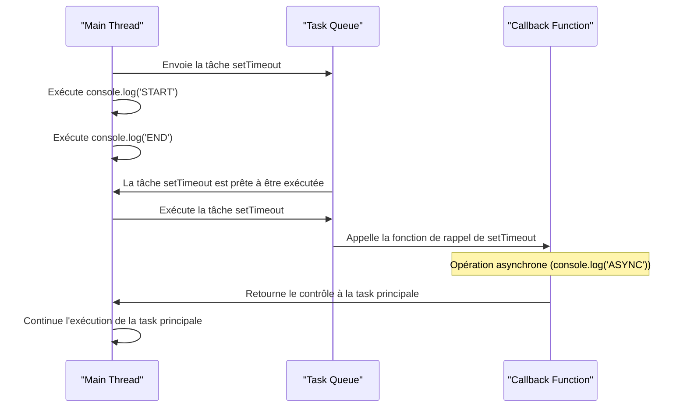

# Asynchrone en JS

## Motivation

> [!NOTE] L'asynchronisme est un concept clé en programmation JavaScript. Il permet d'exécuter des tâches en arrière-plan sans bloquer l'exécution du reste du code.

Nécessité de l'Asynchronisme dans le Développement Web Moderne.

Dans les applications web modernes, de nombreuses opérations, telles que les requêtes réseau ou l'accès à la base de données, sont des opérations asynchrones nécessitant une gestion efficace.

## Introduction

:rocket: On utilise les callbaks dans l'aysnchrone, mais il y a d'autres solutions ... 

>[!NOTE] Définition, les callbacks sont des fonctions qui sont passées en tant que paramètres à d'autres fonctions et sont exécutées après la fin d'une opération asynchrone.

Exécution du code de manière différée. Il permet également de gérer des actions qui "normalement" sont bloquantes. Chaque ligne est exécutée de manière synchrone, si une fonction prend du temps à s'exécuter le code synchrone attend la fin de son exécution.

**JavaScript est synchrone et mono-thread**. Il n'y a qu'un seul fil d'exécution, stack, du code source, chaque ligne est exécutée de manière synchrone. Par contre les lignes asynchrones sont placées dans une file d'exécution (Task Queue). Toutes les fonctions asynchrones seront alors exécutées les unes à la suite des autres par l'Event Loop. Elles seront alors envoyées dans la stack d'exécution principale sans bloquer le reste du programme.

Ce mécanisme constitue le coeur de JS.

Il n'y a pas de parallèlisme en JS, tout est géré dans le même thread.

### Exemple de script asynchrone

```js
console.log('START')
setTimeout( () => console.log('ASYNC'), 500 )
console.log('END')
```

- Diagramme de séquences du script précédent



Par exemple, lorsque vous faites une requête sur une API, vous pouvez fournir à une fonction asynchrone une fonction de callback qui sera exécutée dans la stack d'éxecution une fois la réponse consommée, sans bloquer le reste du code.

Remarques : il peut y avoir plusieurs Task Queue, par exemple le navigateur peut **prioriser** certaines actions asynchrones. Par défaut dans une Task Queue les callbacks sont en mode FIFO (first in first out ou premier entrée premier exécuté).


Un petit dessin pour résumer :


## Exemple de code synchrone

```js

cons synchroneFunc = () => {
    console.log("Start function");
}

console.log("Start");
synchroneFunc();
console.log("End");


```

## Exemples de code asynchrone 

```js
console.log('Start');

setTimeout(() => console.log('Hello world !'), 1000);

console.log('End');
```

## Exercice login callback

Soit le programme asynchrone login suivant. Que vaut à votre avis la variable email dans le script ? Répondez sans exécuter le code.

```js

const login = (email, password ) => {
    setTimeout(() => {
        return { email };
    }, 1000);
}

const email = login('alan@alan.fr', 1234567890);
console.log(email);

```

Ajoutez une fonction de callback afin de récupérer la valeur de l'email une fois l'utilisateur "connecté".

```js
const login = (email, password, callback ) => {
    setTimeout(() => {
        // ...
    }, 1000);
}
```

## Exercice additions callback

1. En utilisant deux fois la fonction add qui est asynchrone et avec sa fonction de callback additionner 1 et 2 

```js
const add = (number, callback) => {
    setTimeout(() => {
        //
    }, 1000);
}
```

Ajoutez maintenant une fonction de callback **error**. Cette fonction sera appelée uniquement lorsqu'une valeur passée en paramètre n'est pas un nombre.

1. Améliorez la fonction d'erreur en levant une exception.

```js

throw new Error('Bad number ...')

```

## Promesse

>[!TIP] Une promesse est un objet représentant la réussite ou l'échec d'une opération asynchrone.

Le Callback Hell (aussi appelé "Pyramid of Doom") est un problème qui survient lorsqu'on utilise de nombreuses fonctions de rappel imbriquées, généralement dans des opérations asynchrones, ce qui rend le code difficile à lire et à maintenir. Voici un exemple simple de Callback Hell en JavaScript :

```javascript
getUser(function (user) {
  getOrders(user.id, function (orders) {
    getProducts(orders, function (products) {
      displayProducts(products, function () {
        // Suite du code...
      });
    });
  });
});
```

Dans cet exemple :

1. `getUser` est une fonction asynchrone qui prend une fonction de rappel pour le résultat de l'utilisateur.
1. `getOrders` est appelée dans la fonction de rappel de `getUser` et prend une autre fonction de rappel pour le résultat des commandes de l'utilisateur.
1. `getProducts` est appelée dans la fonction de rappel de `getOrders` et prend une autre fonction de rappel pour le résultat des produits liés aux commandes.
1. `displayProducts` est appelée dans la fonction de rappel de `getProducts` et prend une autre fonction de rappel pour indiquer que l'affichage des produits est terminé.

Vous pouvez voir comment cela crée une structure pyramidale de fonctions de rappel imbriquées, ce qui peut rapidement devenir difficile à suivre, à déboguer et à maintenir, en particulier lorsque le nombre de fonctions de rappel augmente. C'est là que les Promesses et Async/Await entrent en jeu pour simplifier la gestion de l'asynchronisme et améliorer la lisibilité du code.

:rocket: Nous allons maintenant aborder une autre approche native au JS : les Promesses. Elles simplifient l'utilisation des méthodes asynchrones.

>[!NOTE] Une promesse a un **état initial** en attente : **pending**. Une fois **résolue** elle est dans **l'état settled** et dans ce cas son état ne change plus.

- Pending : En attente d'exécution
- Resolved : Opération réussie
- Rejected : Opération échouée

[!schema](./images/promise.png)

```mermaid

```


- La méthode **then** est une méthode qui sera appelée après le succès de la promesse; en cas d'échec la méthode **catch** sera appelée.

### Exemple de promesse

```js
const p = number => ( new Promise((resolve, reject) => {
    setTimeout(() => {
        if(number > 100) {
            reject(new Error('To big'));
            return;
        }
        resolve(number);
    }, 300);
    })
);

p(9)
.then( num => console.log(num))
.catch( err => console.error(err))

```

Remarque : vous pouvez enchaîner plusieurs promesses, elles seront résolues l'une à la suite de l'autre.

```js
maPromesse
  .then((resultat) => {
    console.log(resultat);
    return "Données supplémentaires";
  })
  .then((donnees) => {
    console.log("Données :", donnees);
  })
  .catch((erreur) => {
    console.error(erreur);
  });
 ``` 

## Exercice add avec des promesses

Reprenez l'exercice précédent avec la fonction **add** mais cette fois-ci utilisez des promesses.

## Promise all

Vous pouvez également lancer plusieurs promesses en même temps. Elles seront avec la méthode all toutes résolues. Si l'une d'entre elles échoue tout s'arrêtera.

```js
const p = number => ( new Promise((resolve, reject) => {
  setTimeout(() => {
    if (isNaN(parseInt(number))) {
        reject( new Error( 'not a number ...' ) );

        return;
    }
    resolve(number);
  }
  , 100);
}) ) ;

Promise.all([p(1), p(2), p(3)]).then(numbers => { 
    console.log( numbers.reduce((acc, curr) => acc + curr) );
}).catch( err => console.error(err));

```

Il existe d'autres méthodes dans les promesses :

-  `Promise.allSettled`
-  `Promise.race`


## Async await

>[!NOTE] Async/Await est une syntaxe qui simplifie la gestion des promesses en les rendant plus lisible et plus expressive.

:rocket: L'opérateur **await** permet d'attendre la résolution d'une promesse. Il ne peut être utilisé qu'à l'intérieur d'une fonction **async**. L'intérêt c'est d'avoir une **logique "synchrone"** sur une partie de code asynchrone.

```js
async function process(){
    try{
        let sum = 0;
        const res1 = await add(1); // attendre la résolution de la promesse
        sum+=res1;
        const res2 = await add(3);
        sum+=res2;
        const res3 = await add(5);
        sum+=res3;

        console.log(sum);
    // si vous lancez une exception à partir de la promesse
    // dans le cas où celle-ci est échoue
    // vous capturez l'exception dans le bloc suivant 
    }catch( err ){
        console.error(err);
    }
}
```

Une fonction async/await peut également retourner une valeur, dans ce cas vous traiterez son retour comme une promesse à l'aide du mot réservé then.

```js
async function process() {
    let sum = 0;
    const res1 = await add(1); 
    sum+= res1;
    const res2 = await add(2); 
    sum+= res2;

    return sum;
}

process()
    .then( sum => console.log(sum))
    .catch(err => console.error(err));
```

### Exercice anim

Soit la Promesse anim, elle retournera une valeur aléatoire composée d'un chiffre de 1 à 9 et d'une lettre comprise entre A et X. 

Executez 10 fois ce générateur pour construire une chaîne aléatoire en utilisant la technique async/await décrite ci-dessus.
